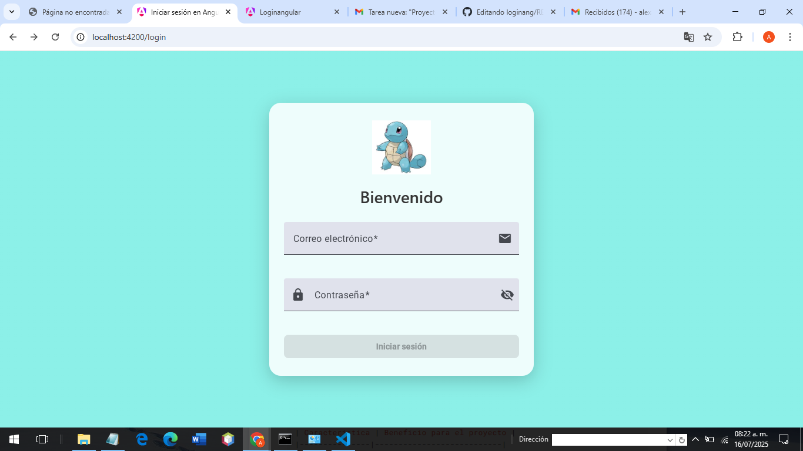
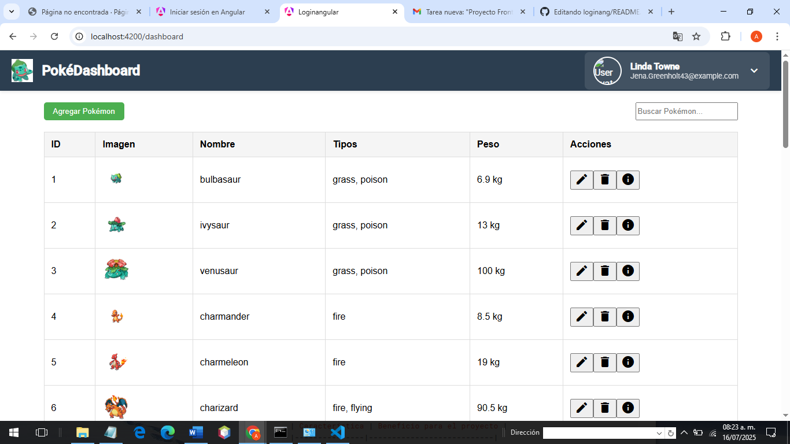
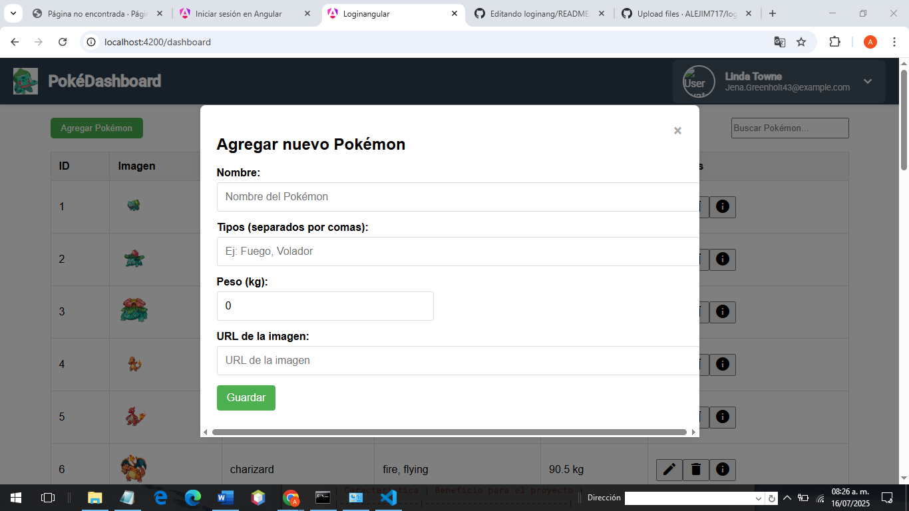
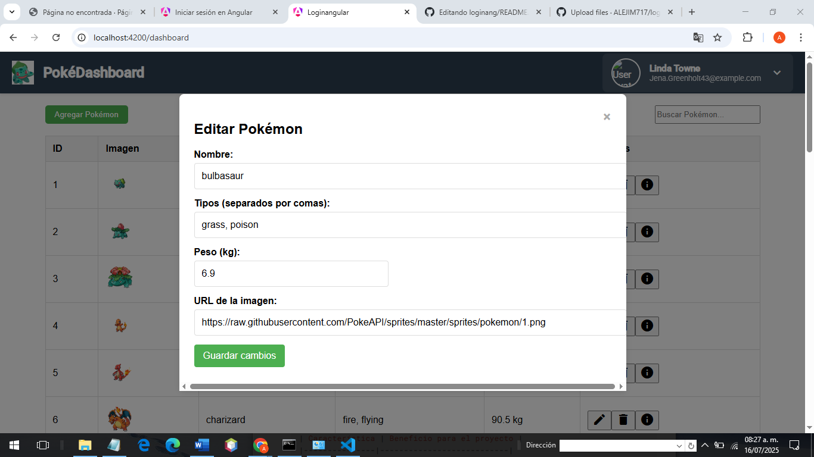
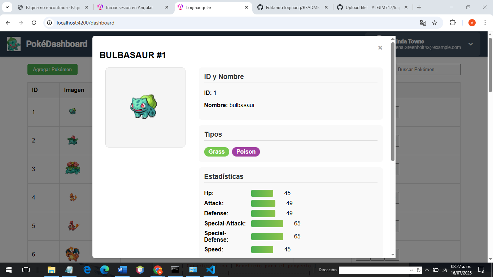

##  Integrantes del equipo
- **RODRIGUEZ HERNANDEZ ALEXA ISABEL**
- **JIMENEZ OSORIO CHRISTOPHER MARTIN**

## Tecnologías usadas

 Angular Material
 TypeScript 
 HTML5
 JSON 

### Flujo de la aplicación
1. **Login**: 
   - `auth.service.ts` valida credenciales contra API de usuario
   - Redirige a `/home`

2. **Página principal**:
   - `data.service.ts` consume API externa (Pokémon/películas)
   - `table.component.ts` muestra datos con paginación/filtros

3. **Perfil**:
   - Muestra datos del usuario desde `auth.service`

##  APIs Elegidas

### 1. API de Usuarios - MockAPI
** Endpoint**:  
'https://68743fcedd06792b9c937143.mockapi.io/api/users'

** Justificación **:  
-  **Simple implementación**: Ideal para prototipado rápido  
-  **Endpoint público**: No requiere autenticación compleja  
## 2. API de Pokémon - PokeAPI

** Endpoint **:  
`https://pokeapi.co/api/v2/pokemon`

**Justificación**:

Incluye imágenes front/back en diferentes estilos 
Contiene stats, habilidades, tipos, movimientos 
No requiere registro ni API keys 

### Imagenes del Funcionamiento
Iniciar sesión

Tabla Pokemones

Agregar Pokemon

Editar Pokemon

Mas informacion

